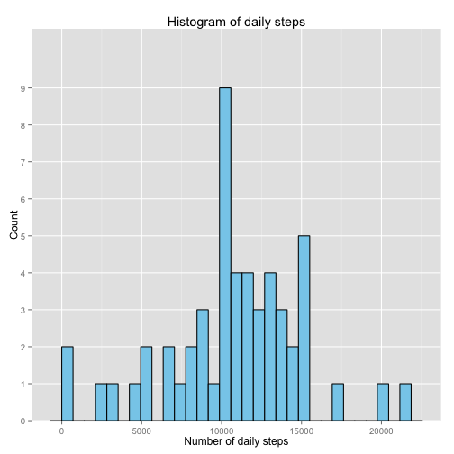
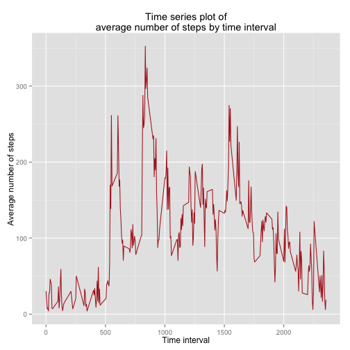
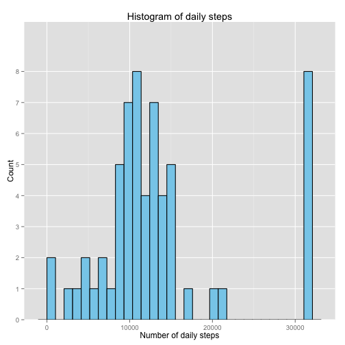
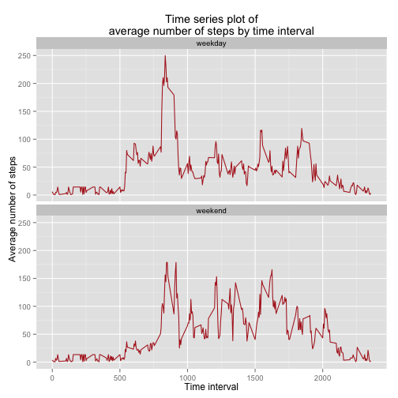

#Introduction
This report explores step activity collected between 1 October and 30 November 2012.
The number of steps were recorded daily during the period at 5-minute intervals.

##Statistics of raw data


```r
#Load packages used for this report
require(ggplot2)
require(dplyr)
require(lubridate)

#Load raw data
dat <- read.csv("activity.csv", stringsAsFactors = FALSE)

#Summarise steps by date (and filter out missing values)
daily <- dat %>% 
    filter(steps >= 1) %>% 
    group_by(date) %>% 
    summarise(dailySteps=sum(steps))

#Create histogram of daily steps
ggplot(daily, aes(dailySteps)) +
    geom_histogram(fill="skyblue", color="black") +
    ggtitle("Histogram of daily steps") +
    labs(x="Number of daily steps", y="Count") +
    scale_y_discrete()
```

```
## stat_bin: binwidth defaulted to range/30. Use 'binwidth = x' to adjust this.
```

 

```r
#Mean and median of the total number of steps taken per day
mean(daily$dailySteps)
```

```
## [1] 10766.19
```

```r
median(daily$dailySteps) 
```

```
## [1] 10765
```

##Time series analysis
Time series plot of the 5-minute interval (x-axis)
and the average number of steps taken, averaged across all days (y-axis)


```r
byInterval <- dat %>% 
    filter(steps >= 1) %>% 
    group_by(interval) %>% 
    summarise(intSteps=mean(steps))

ggplot(byInterval, aes(x=interval, y=intSteps)) +
    geom_line(color="firebrick") +
    ggtitle("Time series plot of\naverage number of steps by time interval") +
    labs(x="Time interval", y="Average number of steps")
```

 

```r
#Time interval with maximum number of steps
byInterval[byInterval$intSteps==max(byInterval$intSteps), ]
```

```
## Source: local data frame [1 x 2]
## 
##   interval intSteps
## 1      835 352.4839
```

##Imptuting missing values
The raw data set contains missing values.
These missing values have been imputed in the following sections.
Imputation is achieved by using the average value of intervals.
For instance if a value for the interval 1315 is missing then the average steps for the 1315 interval across all dates is used. For instances where no such average is available, the average of all intervals is used instead.


```r
#Total number of missing values in the dataset (i.e. the total number of rows with NAs)
nrow(dat) - sum(complete.cases(dat))
```

```
## [1] 2304
```

```r
#Function to impute missing values from mean of time interval
getImputationValue <- function(interval, value) {
    #Returns value if it is not NA
    #If value is NA then it returns the average for the time interval.
    #If there is no such average then it returns the average of all intervals.
    if (!is.na(value)) {
        res = value
    } else {
        res = byInterval[byInterval$interval==interval, "intSteps"][[1]]
    }
    if (!length(res)>0) {
        res = mean(byInterval$intSteps)
    }
    return(res)
}

#New dataset equal to the original dataset but with the missing data filled in.
newDat <- dat
newDat$steps <- mapply(getImputationValue, dat$interval, dat$steps)
```

###Analysis of data with imputed values

```r
#Histogram of data with imputed values
#Summarise steps by date
newDaily <- newDat %>% 
    group_by(date) %>% 
    summarise(dailySteps=sum(steps))

#Create histogram of daily steps
ggplot(newDaily, aes(dailySteps)) +
    geom_histogram(fill="skyblue", color="black") +
    ggtitle("Histogram of daily steps") +
    labs(x="Number of daily steps", y="Count") +
    scale_y_discrete()
```

```
## stat_bin: binwidth defaulted to range/30. Use 'binwidth = x' to adjust this.
```

 

```r
#Mean and median of the total number of steps taken per day

#The imputed values have a noticeable effect on the mean and median of the daily steps
#The differences are calculated below
mean(newDaily$dailySteps) - mean(daily$dailySteps)
```

```
## [1] 2665.425
```

```r
median(newDaily$dailySteps) - median(daily$dailySteps)
```

```
## [1] 693
```

The difference in mean and median of the raw data set versus the data set with imputed values is mainly due to a large number of days with step count over 30000 in the imputed data. This is likely a result of imputing with average number of steps for all periods in cases where there is no average for the respective time interval available. This could be addressed by using a different method of imptutation (e.g. by selecting the nearerst neighbour average in these instances).

##Analysis of weekdays versus weekends
The data (with imputations) is split between weekdays and weekends to reveal trends in step activity between these types of days.


```r
newDat$date = ymd(newDat$date)
dayName <- weekdays(newDat$date)
newDat$dayType <- ifelse(dayName=="Saturday" | dayName=="Sunday", "weekend", "weekday")

#Time series plot of the 5-minute interval (x-axis)
#and the average number of steps taken, averaged across all days (y-axis)
byDayAndInt <- newDat %>% 
    group_by(dayType, interval) %>% 
    summarise(intSteps=mean(steps))

ggplot(byDayAndInt, aes(x=interval, y=intSteps)) +
    geom_line(color="firebrick") +
    facet_wrap(~dayType, nrow=2) +
    ggtitle("Time series plot of\naverage number of steps by time interval") +
    labs(x="Time interval", y="Average number of steps")
```

 

